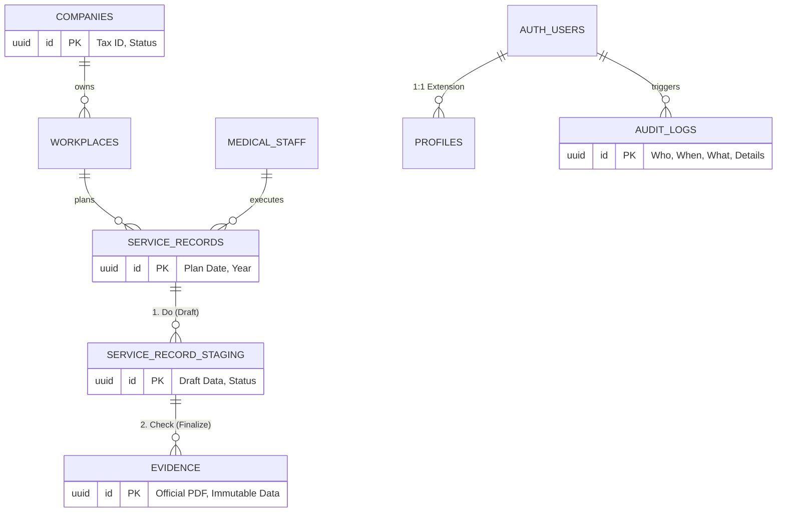
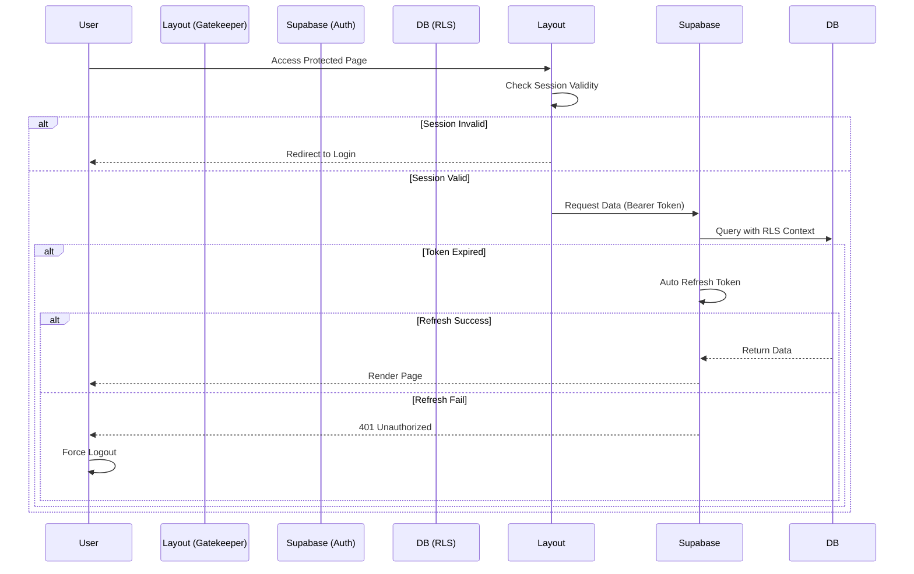

# OHACSS 職業健康評鑑與合規支援系統 - System Governance Whitepaper

**文件版本**: 1.4.0

**適用場景**: 企業資安審查、ISO 稽核驗證、政府標案驗收

**更新日期**: 2026-02-17

---

## 1. 執行摘要 (Executive Summary)

OHACSS 是一個專為職業安全衛生 (OH&S) 設計的企業級 SaaS 解決方案。本系統採用 **PDCA (Plan-Do-Check-Act)** 閉環管理架構，核心目標是協助企業落實 **ISO 45001:2018** 標準。技術架構遵循 **Zero-Trust (零信任)** 與 **Privacy by Design (隱私設計)** 原則，透過 Serverless 架構、RLS (Row Level Security) 與嚴謹的資料庫 Schema 設計，確保數據的機密性、完整性與可用性。

---

## 2. 合規性與標準對照 (Compliance & Standards Alignment)

本系統之模組設計直接對應 **ISO 45001:2018 職業安全衛生管理系統** 之條文要求，可作為企業通過 ISO 驗證之數位佐證工具。

### 2.1 ISO 45001 對照表 (Mapping Table)

| ISO 45001 條文 | PDCA 階段 | 對應系統模組 | 功能實證 (Evidence) |
| --- | --- | --- | --- |
| **5.4 工作者諮商與參與** | **Support** | `support-center.html` 

 (線上客服中心) | 提供工作者(使用者)回報問題、諮詢職安衛事項的雙向溝通管道與紀錄。 |
| **6.1 應對風險的措施** | **Plan** | `service-execution.html` 

 (Step 1: 規劃) | 系統自動帶出年度合約規劃之服務場次，確保法規合規性風險被納入排程。 |
| **8.1 運作規劃與管制** | **Do** | `service-execution.html` 

 (Step 2: 執行) | 數位化執行紀錄表 (Checklist A-Q)，強制記錄作業環境監測與健康服務內容。 |
| **9.1 監控、量測與分析** | **Check** | `admin-overview.html` 

 (管理者總覽) | 針對執行紀錄進行合規性審查，並生成具時戳之不可竄改 PDF 報告。 |
| **9.2 內部稽核** | **Audit** | `audit-logs.html` 

 (系統日誌) | 詳實記錄所有資料異動軌跡 (Who/When/What)，符合稽核軌跡 (Audit Trail) 要求。 |
| **10.2 不符合事項與矯正** | **Act** | `improvement-ac.html` 

 (評鑑改善專區) | 針對審查缺失自動立案，追蹤改善行動直至結案，形成持續改善迴圈。 |

### 2.2 資料隱私與保護 (GDPR / PDPA)

* **Data Minimization**: 系統僅蒐集執行業務必要之欄位，醫護人員個資採最小化原則儲存。
* **Right to be Forgotten**: 支援邏輯刪除 (`is_active=false`) 與物理刪除 (需 Admin 核決)，以符合個資法刪除請求權。

---

## 3. 安全防禦與存取控制 (Security & Access Control)

### 3.1 權限矩陣 (RBAC Matrix)

本系統採用 **Role-Based Access Control**，權限由後端 RLS Policy 強制執行，前端僅做 UI 隱藏。

| 功能模組 | Admin (管理員) | Consultant (顧問) | General (文管/一般) |
| --- | --- | --- | --- |
| **帳號管理** | ✅ CRUD | ❌ 禁止 | ❌ 禁止 |
| **服務紀錄 (Plan/Do)** | ✅ 讀/寫/審 | ✅ 讀/寫 (僅限本人) | 👁️ 唯讀 |
| **審核核決 (Check)** | ✅ 核決/退回 | 👁️ 唯讀 (僅限本人) | 👁️ 唯讀 |
| **改善行動 (Act)** | ✅ 讀/寫 | ✅ 讀/寫 (僅限本人) | 👁️ 唯讀 |
| **系統日誌 (Audit)** | ✅ 完整檢視 | ❌ 禁止 | ❌ 禁止 |

### 3.2 威脅防禦策略 (Threat Mitigation)

* **XSS 防護**: 嚴格限制 `innerHTML` 的使用，動態內容渲染優先使用 `textContent`。計畫導入 **CSP** Header。
* **Session 安全**: Access Token 預設存於 `localStorage`。企業版可選配 `HttpOnly Cookie` 模式。
* **API 安全**: 全面啟用 Rate Limiting，防止暴力破解與 DDoS 攻擊。

---

## 4. 營運韌性與災難復原 (Resilience & DR)

### 4.1 備份策略 (Backup Strategy)

系統依賴 Supabase (PostgreSQL) 的企業級備份機制：

* **PITR (Point-in-Time Recovery)**: 支援回復至過去 7 天內任意時間點的資料狀態。
* **Daily Backups**: 每日自動完整備份，保留 30 天。
* **Geo-Redundancy**: 資料庫儲存於雲端高可用區域 (Availability Zones)。

### 4.2 復原目標 (Recovery Objectives)

* **RPO (Recovery Point Objective)**: < 1 分鐘 (基於 WAL Logs)。
* **RTO (Recovery Time Objective)**: < 4 小時 (視資料量大小而定)。

### 4.3 錯誤處理分級 (Error Handling)

| 等級 | 定義 | 響應策略 | 通知機制 |
| --- | --- | --- | --- |
| **L1 (Critical)** | 系統停機、資料遺失風險 | 切換至維護頁面 | SMS/Email 通知維運團隊 |
| **L2 (Major)** | 核心功能 (如登入、上傳) 失敗 | UI 阻斷並引導重試 | 寫入 Error Log |
| **L3 (Minor)** | 非核心顯示錯誤 | UI 靜默處理 (降級顯示) | Console Log |

---

## 5. 系統架構與數據治理 (Architecture & Data Governance)

本系統採用 **PostgreSQL** 關聯式資料庫，透過嚴謹的 Schema 設計來落實 ISO 45001 的管理循環。系統將「作業資料 (Operational Data)」與「稽核證據 (Evidence)」在物理層面進行隔離，確保數據的不可否認性。

### 5.1 實體關聯圖 (ER Diagram)

### 5.2 資料字典與合規對照 (Data Dictionary)

| 資料表名稱 | 職責與合規意義 | ISO 45001 對應 |
| --- | --- | --- |
| **`companies`** | **客戶主檔**。記錄合約效期與服務狀態，作為規劃服務的基礎。 | 組織背景 (Context) |
| **`workplaces`** | **作業場所**。定義危害類型與勞工人數，用於風險分級管理。 | 危害辨識 (6.1.2) |
| **`medical_staff`** | **醫護人員名單**。管理證照與聘僱狀態，確保服務提供者具備資格。 | 資源與能力 (7.2) |
| **`service_records`** | **母案/年度計畫 (Plan)**。預先建立的服務場次空殼，代表「應執行的義務」。 | 規劃 (6.1) |
| **`service_record_staging`** | **暫存/審核區 (Do)**。顧問上傳原始紀錄的緩衝區。資料在此可被修改，但需經過審核流程。 | 運作管制 (8.1) |
| **`evidence`** | **正式證據庫 (Check/Act)**。經核決後的最終狀態。**資料在此為唯讀 (Read-only)**，任何異動皆需透過「評鑑流程」進行。 | 績效評估 (9.1) |
| **`audit_logs`** | **系統稽核日誌**。由 DB Trigger 自動寫入，記錄所有 Table 的增刪改操作 (Who/When/What)。 | 內部稽核 (9.2) |

### 5.3 關鍵設計決策 (Key Design Decisions)

1. **JSONB 的使用**：在 `evidence` 表中使用 `assessment_logs` 與 `act_improvements` 儲存 JSONB 陣列，保留完整的對話與修改歷程 (History)，而非僅覆蓋最新狀態，符合 ISO 對於「持續改善」軌跡的要求。
2. **狀態機設計 (State Machine)**：`status` 欄位 (`pending` -> `approved` -> `closed`) 嚴格控制資料流向，防止未經審核的資料進入正式報表。
3. **邏輯刪除 (Soft Delete)**：核心表使用 `is_active` 欄位代替物理刪除，確保歷史關聯資料不會因人員離職或合約終止而遺失。

### 5.4 核心驗證流程 (Auth Sequence)

---

## 6. 開發與部署規範 (Development & Deployment)

### 6.1 環境需求

* **Local**: 靜態 Web Server (Live Server / Python SimpleHTTPServer)。
* **Production**: 支援 HTTPS 的靜態託管服務 (Vercel / Netlify / AWS S3 + CloudFront)。

### 6.2 部署檢查清單 (Go-Live Checklist)

* [ ] **ISO Compliance**: 確認 `support-center.html` 與 `improvement-ac.html` 功能運作正常，以符合 ISO 45001 條文 5.4 與 10.2。
* [ ] **Security**: 確認 `config.js` 指向正式環境，且無測試用 Service Role Key 殘留。
* [ ] **RLS Validation**: 執行 `admin` 與 `consultant` 帳號的交叉存取測試，確保資料隔離生效。
* [ ] **Audit Verification**: 執行一筆資料修改，確認 `audit_logs` 表中有新增對應紀錄。

---

## 7. 未來擴充路線 (Roadmap)

1. **ISO 報表中心**: 自動生成符合勞檢要求的「職安衛績效分析報告」。
2. **AI 稽核預警**: 利用 AI 分析 `audit_logs`，主動偵測異常操作行為 (Anomaly Detection)。
3. **多因子驗證 (MFA)**: 針對 Admin 帳號強制啟用 TOTP 驗證，提升存取安全。

---

*Confidential & Proprietary - OHACSS Governance Team.*
*Aligned with ISO 45001:2018 & GDPR Standards.*
